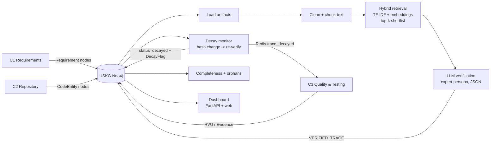

# Component 4: AI Traceability Intelligence Agent — report draft

Status: every number below was measured in this repository. Items marked **PENDING** are
produced by `scripts/final_evaluation.sh` and must be filled in from `data/runs/_logs/`.

## 1. Research gap

Traceability tools (IBM DOORS, Jama, Polarion, issue linking) create a link once, by hand, and
never re-check it, so links silently go stale when code changes. Automated approaches trade
precision against recall: rule-based and embedding-only methods find candidates but accept many
false links, while asking an LLM about every requirement-artifact pair is too slow and costly.
Existing research tools also produce trace links as a one-off, disconnected output.

This component fills that gap by (a) combining cheap retrieval for recall with LLM verification
for precision (the TraceLLM approach, with a "software traceability expert" role prompt),
(b) persisting verified links as `VERIFIED_TRACE` edges in the shared USKG so four agents use one
live source of truth, and (c) re-verifying links when either side changes, flagging decay without
deleting history, and notifying Component 3.

## 2. Methodology

1. **Load** requirements (`Requirement`, owned by C1) and code entities (`CodeEntity`, owned by C2) from Neo4j.
2. **Prepare text.** Code is stripped of `import`/`package` lines and licence headers, identifiers
   are split (`addPatientRecord` -> `add patient record`); long files are cut into 60-word chunks
   and a file scores as its best chunk (embedding models read only 128-256 tokens).
3. **Retrieve (recall).** TF-IDF and sentence-embedding (all-MiniLM-L6-v2) similarities are fused
   by summing per-requirement z-scores; the top-k targets per requirement are shortlisted, with no
   similarity cutoff (a cutoff only lost recall).
4. **Verify (precision).** Each shortlisted pair goes to Llama 3.1 8B (JSON mode) which returns
   `is_linked`, `confidence` and a justification; a link is kept if linked and confidence >= 0.5.
5. **Write.** `MERGE` a `VERIFIED_TRACE` edge (idempotent) with confidence, justification, status,
   timestamps and a hash of both texts.
6. **Monitor decay.** Poll verified links; if the stored text hash differs from the current texts,
   re-verify. On failure set `status = decayed`, create a `DecayFlag` (the edge is never deleted)
   and publish a `trace_decayed` event on Redis Pub/Sub for C3.
7. **Score.** Completeness per requirement (0 for orphans; otherwise
   `100 * (0.6 * mean trace confidence + 0.4 * C3 evidence coverage)`).

## 3. Architecture

## 4. Requirements and status

| Requirement | Status |
|---|---|
| Candidate links by embedding similarity | Done (hybrid TF-IDF + embeddings) |
| LLM verification, confidence 0-1 | Done |
| Plain-language justification | Done (stored on the edge) |
| Store `VERIFIED_TRACE` edges | Done; tested against a real Neo4j |
| Re-evaluate on change | Done; unit-tested, and tested end to end on real Neo4j with a stubbed LLM |
| Mark decayed without deleting | Done; real-Neo4j tested (edge kept, `DecayFlag` created) |
| Real-time decay notification | Implemented (Redis publisher, mocked in tests); **not run against a real Redis server** |
| Completeness score, orphans | Done; CLI (`score`) and dashboard panel |
| Only C4 writes `VERIFIED_TRACE`/`DecayFlag` | Enforced in the write layer (allow-list and validator); Neo4j Community has no role-based access control, so this is not enforced by the database itself |

## 5. Evaluation

### 5.1 Datasets
iTrust (CoEST): 131 use cases, 392 code files (227 Java + 165 JSP; one duplicate id dropped),
399 expert-labelled links among 51,352 pairs; 20 use cases have no link. CM-1 (NASA, MIT licence):
22 high-level requirements, 53 design elements, 45 links among 1,166 pairs. Defects4J / Apache
Commons were not used: they carry no requirement links, so they cannot give ground-truth traces.

### 5.2 Stage-1 recall ceiling on iTrust (share of the 399 true links shortlisted; no LLM)

| top_k | MiniLM, raw text | TF-IDF, cleaned | MiniLM, cleaned | Hybrid, cleaned | **Hybrid, cleaned + chunked** |
|---|---|---|---|---|---|
| 10 | 9.0% | 36.1% | 23.3% | 38.8% | **41.9%** |
| 20 | 13.0% | 49.1% | 31.6% | 47.9% | **55.4%** |
| 50 | 28.3% | 60.2% | 44.4% | 57.9% | **68.4%** |

A code-aware embedding model (st-codesearch-distilroberta-base, 128-token limit) scored 20.1% alone
at top-10 unchunked and 32.8% chunked, no better than MiniLM (33.3% chunked); fusing it added nothing,
so it was not adopted. Chunk size (60 words) and the fusion method were chosen on the same labels,
so these figures are slightly optimistic. The 80% recall target is **not met** on iTrust.

### 5.3 Full pipeline vs baselines (iTrust, first 10 requirements, top-5, 35 true links)

| Method | Predicted | TP | FP | Precision | Recall | F1 |
|---|---|---|---|---|---|---|
| Embeddings only (MiniLM) | 50 | 3 | 47 | 0.060 | 0.086 | 0.071 |
| TF-IDF only | 50 | 6 | 44 | 0.120 | 0.171 | 0.141 |
| Hybrid retrieval, no LLM | 50 | 7 | 43 | 0.140 | 0.200 | 0.165 |
| **Full pipeline (expert prompt, Llama 3.1 8B)** | 16 | 6 | 10 | **0.375** | 0.171 | **0.235** |

The LLM stage kept 6 of the 7 true links in the shortlist and removed 33 of 43 false ones.
Recall is capped by the shortlist (20%). The precision target (90%) is **not met**. One run, 35 true
links: treat differences of a link or two as noise.

### 5.4 Persona ablation (expert vs generic prompt, same 50 pairs) — **PENDING**
Run by step 1 of `scripts/final_evaluation.sh` (log `1_ablation_generic.log`). Compare with 5.3.

### 5.5 Real graph write (CM-1 in Neo4j) — **PENDING**
Step 2 (`2_link_cm1.log`): `VERIFIED_TRACE` edges written by `python -m agents.traceability_agent link`.

### 5.6 Decay-injection test (target >= 85% detected) — **PENDING**
Step 3 (`3_decay_injection.log`): per-mutation detection and false-decay rate on the verified links.

### 5.7 Non-functional measurements

| NFR | Target | Measured |
|---|---|---|
| LLM verification latency | <= 5 s | **Not met**: typical 52 s, p95 80 s on a CPU-only server (4 vCPU, no GPU); two calls stalled to the 900 s timeout (mean 89 s). Needs GPU or a hosted API. |
| Scale: >= 10,000 nodes | queries < 2 s | **Met**: on 10,000 `CodeEntity` nodes with indexes, `write_link` 8 ms, `get_traces` 4 ms, reading all code entities 0.48 s |
| Accuracy | P >= 90%, R >= 80% | **Not met** (5.2, 5.3) |

## 6. Limitations
- Stage 1 caps recall; iTrust use cases share little vocabulary with code.
- An 8B model on CPU is slow and only moderately precise; a stronger model is untested.
- Small evaluation sample (10 requirements); the planned 100-150 pairs need a faster LLM.
- C1/C2 property names (`text`, `kind`) and C3 Evidence/RVU structure are assumptions to confirm with the team.
- `HAS_DECAY` is attached to the requirement because Neo4j cannot link a node to a relationship.
- Redis publication is untested against a live server.

## 7. References
- TraceLLM: LLMs with prompt engineering for requirements traceability — https://arxiv.org/pdf/2602.01253
- Enhancing automated software traceability by transfer learning from open-world data (NLTrace) — https://arxiv.org/pdf/2207.01084
- Grand Challenges of Traceability — https://arxiv.org/pdf/1710.03129
- CM-1 dataset (NASA; MIT licence) — https://huggingface.co/datasets/thearod5/CM1
- iTrust and EasyClinic (CoEST), Hugging Face conversions by thearod5
- sentence-transformers all-MiniLM-L6-v2; Llama 3.1 8B served with Ollama
